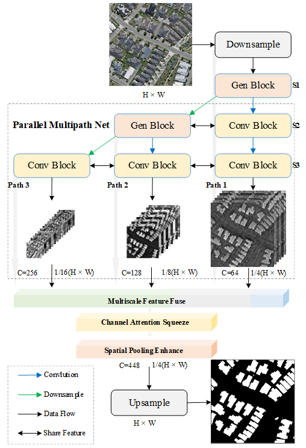
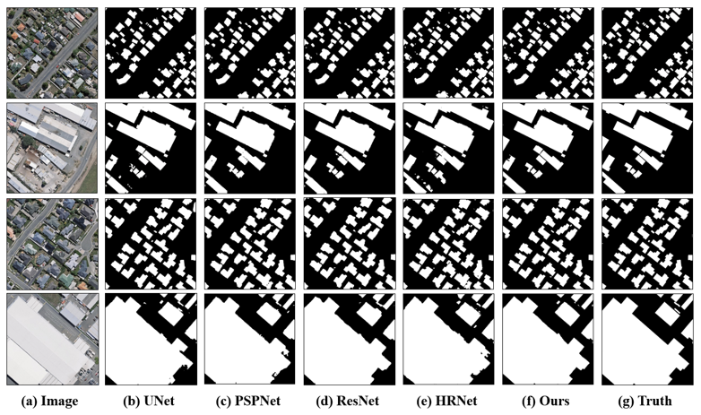

# **MAP-Net: Multi Attending Path Neural Network for Building Footprint Extraction from Remote Sensing Imagery**

## Related resources
Accurately and efficiently extracting building footprints from a wide range of remote sensed imagery remains a challenge due to their complex structure, variety of scales and diverse appearances. Existing convolutional neural network (CNN)-based building extraction methods are complained that they cannot detect the tiny buildings because the spatial information of CNN feature maps are lost during repeated pooling operations of the CNN, and the large buildings still have inaccurate segmentation edges. Moreover, features extracted by a CNN are always partial which restricted by the size of the respective field, and large-scale buildings with low texture are always discontinuous and holey when extracted. This paper proposes a novel multi attending path neural network (MAP-Net) for accurately extracting multiscale building footprints and precise boundaries. MAP-Net learns spatial localization-preserved multiscale features through a multi-parallel path in which each stage is gradually generated to extract high-level semantic features with fixed resolution. Then, an attention module adaptively squeezes channel-wise features from each path for optimization, and a pyramid spatial pooling module captures global dependency for refining discontinuous building footprints. Experimental results show that MAP-Net outperforms state-of-the-art (SOTA) algorithms in boundary localization accuracy as well as continuity of large buildings. Specifically, our method achieved 0.68\%, 1.74\%, 1.46\% precision, and 1.50\%, 1.53\%, 0.82\% IoU score improvement without increasing computational complexity compared with the latest HRNetv2 on the Urban 3D, Deep Globe and WHU datasets, respectively.

(https://arxiv.org/abs/1910.12060)

### Datasets:

* [Whu](http://study.rsgis.whu.edu.cn/pages/download/building_dataset.html)
* [Urban](https://spacenetchallenge.github.io/datasets/Urban_3D_Challenge_summary.html)
* [Space Net](https://spacenetchallenge.github.io/datasets/spacenetBuildings-V2summary.html)


## MAP-Net

Structure of MAP-Net<bar>


​         *Structure of the proposed MAP-Net, which composed of three modules (A) Detail preserved multipath feature extract network; (B) Attention based features adaptive Squeeze and global spatial pooling enhancement module; (C) Up sampling and building footprint extraction module. Conv block is composed of series residual modules to extract features and shared with each path. Gen block generates new parallel path to extract richer semantic features on the basic of Conv block.*  


## Result



​         *Example of results with the UNet, PSPNet, ResNet101, HRNetv2 and our proposed method respectively on the WHU dataset. (a) Original image. (b) UNet. (c) PSPNet. (d) ResNet101. (e) HRNetv2. (f) Ours. (g) Ground truth.*  

## Citation
If this repo is useful in your research, please kindly consider citing our paper as follow.
```
Bibtex
@article{zhu2019mapnet,
    title={MAP-Net: Multi Attending Path Neural Network for Building Footprint Extraction from Remote Sensed Imagery},
    author={Zhu, Qing and Liao, Cheng and Hu, Han and Mei, Xiaoming and Li, Haifeng},
    journal={arXiv:1910.12060},
    DOI = {arXiv:1910.12060},
    year={2019},
    type = {Journal Article}
}

Endnote
%0 Journal Article
%A Zhu, Qing
%A Liao, Cheng
%A Hu, Han
%A Mei, Xiaoming
%A Haifeng Li
%D 2019
%T MAP-Net: Multi Attending Path Neural Network for Building Footprint Extraction from Remote Sensed Imagery
%B arXiv:1910.12060
%R https://arxiv.org/abs/1910.12060
%! MAP-Net: Multi Attending Path Neural Network for Building Footprint Extraction from Remote Sensed Imagery

```

##  Help

Any question? Please contact my with: liaocheng@my.swjtu.edu.cn


